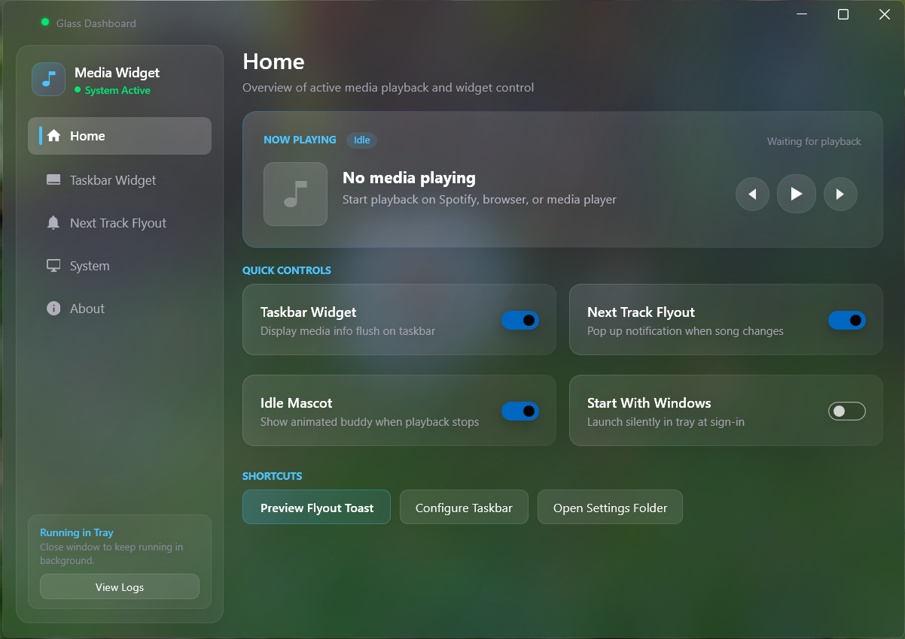
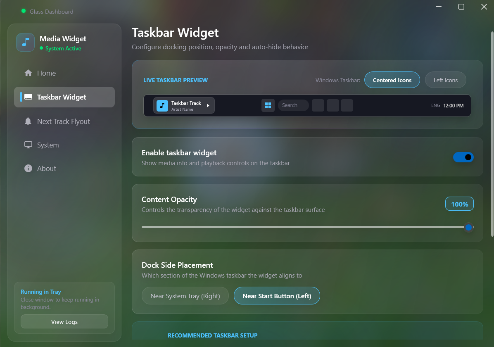
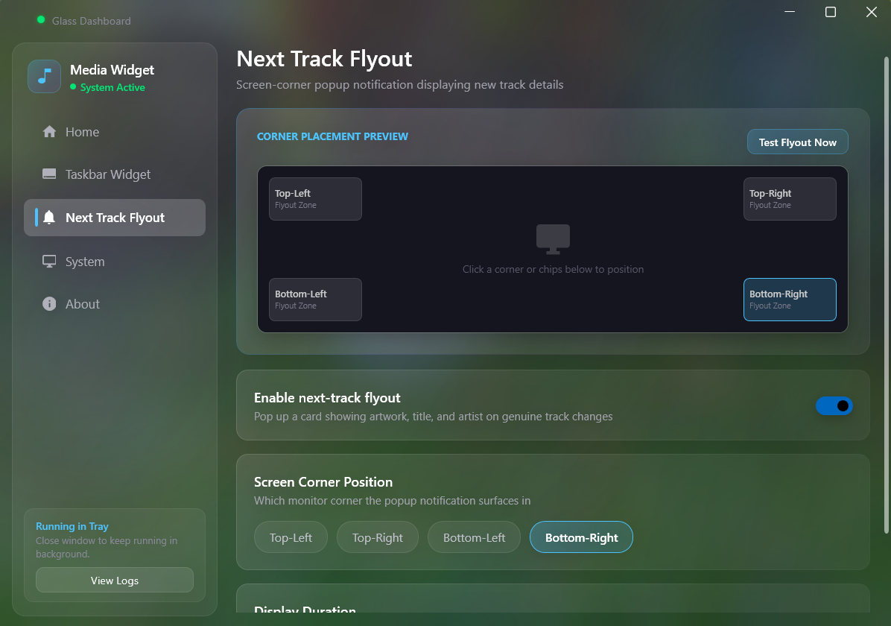

# Taskbar Media Widget

A Windows 11 media controller that docks **flush into the taskbar** — album art, track title, artist
and transport controls drawn directly onto the bar, with no card or window chrome around them. It
reads the real Windows **System Media Transport Controls (SMTC)**, so it follows whatever is
actually playing — Spotify, a browser tab, VLC, Windows Media Player — and its buttons drive that
same system session.

Everything is configured from a built-in dashboard. One executable, one process, sits in the tray.



---

## Contents

- [Can you really put a widget *inside* the Windows 11 taskbar?](#can-you-really-put-a-widget-inside-the-windows-11-taskbar)
- [Features](#features)
- [Screenshots](#screenshots)
- [Requirements](#requirements)
- [Build and run](#build-and-run)
- [Publishing a standalone .exe](#publishing-a-standalone-exe)
- [How it starts](#how-it-starts)
- [Settings](#settings)
- [Architecture](#architecture)
- [Project layout](#project-layout)
- [Hard-won implementation notes](#hard-won-implementation-notes)
- [Troubleshooting](#troubleshooting)
- [Known limitations](#known-limitations)

---

## Can you really put a widget *inside* the Windows 11 taskbar?

No — and it's worth being straight about that, because it's the question the whole design hangs on.

The Windows 11 taskbar is a private, undocumented Explorer control. No public SDK lets a third-party
process draw *inside* it. Reparenting a foreign window into `Shell_TrayWnd` with `SetParent` is
technically possible but fragile: Explorer re-lays-out the taskbar and fights you, an `explorer.exe`
restart (theme changes, crashes, some updates) evicts your window, and AV/EDR products flag the
behaviour as injection-like even though no code is injected.

So this takes the approach real shipped "taskbar widget" apps use: a **separate, borderless,
layered, always-on-top window that continuously tracks the taskbar's live geometry and state** and
positions itself flush inside the bar. Because it's fully transparent with no background of its own,
what you see is the taskbar showing through behind the content — visually it reads as part of the
bar, and empty areas even pass clicks through to the taskbar underneath.

The geometry is verified rather than assumed: after every reposition the app reads its own window
rect back via `GetWindowRect` and logs it beside the taskbar's rect, so "is it exactly on the bar?"
is a checkable fact (`topDelta=0 bottomDelta=0`) instead of a judgement call.

## Features

**Media**
- Live track title, artist and album art from the active SMTC session — event-driven, no polling
- Previous / play-pause / next, driving the system session (not any one app)
- A "now playing" flyout on genuine track changes, in a configurable screen corner

**Taskbar integration**
- Docks flush into the taskbar band — exact height, no spill onto the desktop
- Follows the taskbar's real position and edge via `SHAppBarMessage(ABM_GETTASKBARPOS)`
- Hides when the taskbar auto-hides, and when anything covers the bar (fullscreen video, games)
- Re-asserts its z-order so Win+D / show-desktop can't strand it behind the bar
- Multi-monitor aware, including secondary taskbars, with Per-Monitor-V2 DPI handling
- Follows Windows light/dark mode

**Idle**
- When nothing is playing, an animated mascot wanders the strip — walks, hops, sparks and chirps
  instead of showing a dead "no media" row
- Auto-hides entirely after a configurable idle timeout (or never, if set to Permanent)

**App**
- Dashboard-first: run it and you get the settings window; everything is toggled from there
- Single instance — launching again surfaces the existing window
- Lives in the system tray; closing the dashboard leaves it running
- Optional start-with-Windows that boots silently into your saved preferences

## Screenshots

| Taskbar Widget settings | Flyout settings |
|---|---|
|  |  |

## Requirements

- Windows 10 1903+ or Windows 11 (Windows 11 recommended — the taskbar behaviour is tuned for it)
- To build: the .NET 8 SDK, or Visual Studio 2022 with the *.NET desktop development* workload
- To run a published build: nothing — it's self-contained

## Build and run

```bash
dotnet build -c Release
dotnet run -c Release
```

Or open the folder in Visual Studio and press F5.

## Publishing a standalone .exe

```bash
dotnet publish -c Release -r win-x64 --self-contained true -p:PublishSingleFile=true -p:EnableCompressionInSingleFile=true -p:IncludeNativeLibrariesForSelfExtract=true
```

That produces a single ~77 MB `TaskbarMediaWidget.exe` in `publish\` with the .NET runtime and
WPF's native libraries embedded. Copy that one file anywhere and run it — no install, no runtime
prerequisite. (`IncludeNativeLibrariesForSelfExtract` is what folds in `wpfgfx_cor3.dll`,
`PresentationNative_cor3.dll` and friends; without it they sit loose next to the exe.)

## How it starts

| Launched as | What happens |
|---|---|
| `TaskbarMediaWidget.exe` | Dashboard opens, tray icon appears, widget runs per saved settings |
| `TaskbarMediaWidget.exe --startup` | **Silent** — tray icon and widget only, no dashboard |
| Launched again while running | No second instance; the running one surfaces its dashboard |

Turning on **Start with Windows** (System page) writes `"<path>\TaskbarMediaWidget.exe" --startup`
to `HKCU\Software\Microsoft\Windows\CurrentVersion\Run`. That's the whole point of the `--startup`
flag: at boot you get the widget behaving exactly as you left it, with no window in your face and
nothing to re-enable.

Closing the dashboard leaves the app running in the tray. Reopen from the tray icon; quit from
there too.

## Settings

Configured from the dashboard. Persisted to `%LocalAppData%\TaskbarMediaWidget\settings.json`,
which the app also watches — edit it by hand and changes apply live.

| Key | Default | Meaning |
|---|---|---|
| `WidgetEnabled` | `true` | Master switch for the taskbar strip |
| `FlyoutEnabled` | `true` | Master switch for the next-track popup |
| `IdleAnimationEnabled` | `true` | Show the mascot when idle (`false` = plain text row) |
| `IdleHideTimeoutSeconds` | `10` | Seconds after playback stops before hiding. **`0` = never hide** |
| `FlyoutDurationSeconds` | `4` | How long the popup stays up |
| `Opacity` | `0.85` | Widget content opacity, `0.3`–`1.0` |
| `DockSide` | `"Tray"` | `"Tray"` (near the clock) or `"Start"` (near the Start button) |
| `FlyoutPosition` | `"BottomRight"` | `"TopLeft"`, `"TopRight"`, `"BottomLeft"`, `"BottomRight"` |
| `TargetMonitorKey` | `null` | `null` = primary, else `"x,y"` — the monitor's top-left corner in virtual-desktop coordinates |

`TargetMonitorKey` uses a coordinate rather than a device name deliberately: it's the one monitor
identity that Win32 and other tooling can both produce and match without reconciling name formats.

Note the dashboard's auto-hide control offers presets (1m / 5m / 10m / Permanent). A hand-edited
value outside that set displays as the nearest preset and will be rewritten to it if you touch the
control.

## Architecture

One WPF process. `App` is the entry point and owns the single-instance guard; `MainWindow` is both
the taskbar strip and the host for the long-lived services; the dashboard, flyout and idle banner
are separate windows/controls it opens.

```
App.xaml.cs ──── single-instance mutex, --startup handling
     │
     └── MainWindow ─── the taskbar strip + service host
            ├── MediaSessionService   what's playing, transport controls (SMTC)
            ├── TaskbarTracker        taskbar geometry / visibility / occlusion
            ├── ThemeWatcher          system light-dark
            ├── SettingsWatcher       live settings reload
            ├── TrayIconManager       tray icon and menu
            ├── DashboardWindow       the settings UI
            ├── NextTrackFlyout       "now playing" popup
            └── IdleBanner            the idle mascot
```

**Settings flow.** The dashboard mutates the shared `AppSettings` instance and calls `Save()`;
`SettingsWatcher` (a debounced `FileSystemWatcher`) picks the write up and re-applies it to the
running widget. That indirection is deliberate — it means hand-editing the JSON works identically
to using the UI.

**Taskbar tracking.** `SHAppBarMessage` is authoritative for the docked *edge*; the live rect comes
from `GetWindowRect` on the taskbar window. Updates arrive from a WinEvent hook scoped to Explorer's
process, with a 500 ms poll as a safety net.

## Project layout

| Path | Purpose |
|---|---|
| `App.xaml` / `.cs` | Entry point, single-instance guard, `--startup` handling, global exception logging |
| `MainWindow.xaml` / `.cs` | The taskbar strip; positioning, visibility, and service wiring |
| `Dashboard/DashboardWindow.xaml` / `.cs` | Settings dashboard (WPF-UI Fluent controls) |
| `Widget/IdleBanner.xaml` / `.cs` | Idle mascot — vector sprite, behaviours, animation scheduler |
| `Flyout/NextTrackFlyout.xaml` / `.cs` | Transient "now playing" popup |
| `Media/MediaSessionService.cs` | SMTC wrapper — session, track, playback state, transport |
| `Media/MediaSnapshot.cs` | Immutable snapshot of what's playing |
| `Windows/TaskbarTracker.cs` | Taskbar geometry, edge, auto-hide, occlusion, WinEvent hook |
| `Windows/TaskbarInfo.cs` | Taskbar state record |
| `Windows/DisplayManager.cs` | Monitor enumeration, per-monitor DPI, coordinate conversion |
| `Windows/WindowStyler.cs` | Tool-window style, topmost pinning, DWM dark mode / rounded corners |
| `Windows/ThemeWatcher.cs` | System light/dark detection |
| `Windows/TrayIconManager.cs` | Tray icon and context menu |
| `Settings/AppSettings.cs` | Settings model, JSON load/save |
| `Settings/SettingsWatcher.cs` | Live reload on file change |
| `Settings/StartupManager.cs` | Run-key registration |
| `Settings/Logger.cs` | Diagnostic log |
| `app.manifest` | Per-Monitor-V2 DPI awareness |

## Hard-won implementation notes

Landmines hit while building this. They're documented in the code too, but they're the kind of thing
that silently wastes an afternoon, so they're worth collecting.

**`ABM_GETTASKBARPOS` does not tell you whether the taskbar is visible.** It reports the taskbar's
*docked reservation*, which does not move or shrink when auto-hide slides the bar off-screen. Use it
for the edge; use `GetWindowRect` on the taskbar window for the live position.

**A non-layered window with a transparent background renders blank.** `AllowsTransparency="False"`
plus `Background="Transparent"` is an invalid pairing in WPF — the window sizes and positions
correctly but paints no content at all, with no error. Either use a real layered window
(`AllowsTransparency="True"`) or give it an opaque background.

**Mica (`DWMWA_SYSTEMBACKDROP_TYPE`) is unreliable on plain WPF windows.** WPF doesn't participate in
DWM's composition pipeline the way Win32/WinUI3 apps do; applying a system backdrop can leave the
window's own content invisible. Also, Mica is a DWM attribute applied independently of any merged
theme dictionary — without `DWMWA_USE_IMMERSIVE_DARK_MODE` it renders in *light* mode regardless of
your XAML theme, so the desktop washes through behind dark-theme text.

**`SizeToContent` silently overrides an explicit `Height`.** With `SizeToContent="Width"`, WPF's
remeasure can reset a `Height` you assigned in code back to the content's natural size. Hard
`MinHeight`/`MaxHeight` constraints are what actually survive the remeasure.

**`Storyboard.Completed`'s `sender` is not the `Storyboard`.** It's an internal `ClockGroup`. Casting
it throws — and if that cast sits above your cleanup code, the cleanup never runs. Unsubscribe via
the captured storyboard reference instead.

**`SetWinEventHook` silently does nothing if `eventMin > eventMax`.** No error, no return-code
failure, just a hook that never fires. Easy to write backwards when the constant you want
(`EVENT_OBJECT_LOCATIONCHANGE`, `0x800B`) is numerically above the one you pair it with.

**`Checked`/`Unchecked` fire on programmatic and focus-driven changes, not just clicks.** Wiring
persistence to them means merely navigating a settings UI can rewrite the user's settings. Use
`Click`, which only fires on a real gesture.

**Rounded corners bring a drop shadow.** `DWMWA_WINDOW_CORNER_PREFERENCE` makes DWM paint a shadow
*outside* the window rect. For a window meant to sit exactly inside the taskbar band, that shadow
spills onto the desktop and reads as the widget overflowing the bar.

**Detecting "something is covering the taskbar" by heuristic doesn't work.** Comparing the
foreground window's rect to the monitor false-positives on merely *maximized* windows (Windows
inflates their rect by the invisible resize border), and `SHQueryUserNotificationState` reports
fullscreen for borderless-fullscreen editors that aren't covering the bar. Hit-testing the taskbar's
own midpoint with `WindowFromPoint` answers the question directly and handles every cause at once.

**WinForms + WPF in one project means ambiguous type names.** `UseWindowsForms` (needed here for
`NotifyIcon`) puts `Application`, `Point`, `Size`, `Color` and `UserControl` in scope from both
frameworks. Alias them explicitly.

## Troubleshooting

The app writes a diagnostic log to:

```
%LocalAppData%\TaskbarMediaWidget\log.txt
```

It records startup mode, taskbar geometry and visibility decisions, media session events, settings
reloads, flyout lifecycle, and any unhandled exception with a full stack trace. Almost every issue
is diagnosable from it. Useful lines to look for:

- `PositionForTaskbar: taskbar(px)=… widget(px)=… topDelta=0 bottomDelta=0` — the widget is exactly
  on the bar. Non-zero deltas mean the geometry is off.
- `ApplyTaskbarInfo: … Collapsed=… Obscured=… IsVisible=…` — why the widget is or isn't showing.
- `UpdateWindowVisibility: taskbarVisible=… shouldShowForMedia=… shouldBeVisible=…` — the visibility
  decision, broken into its inputs.
- `HandleMediaSnapshot: HasSession=… IsPlaying=… Title=…` — what SMTC is reporting.

**The widget never appears.** Check `WidgetEnabled` in settings, and look for `shouldBeVisible=False`
in the log to see which input is false. If nothing has played since launch, the mascot should show —
unless `IdleAnimationEnabled` is off and the idle timeout has already elapsed.

**It vanishes after a few seconds.** That's `IdleHideTimeoutSeconds` doing its job. Set auto-hide to
**Permanent** in the dashboard to keep it up.

**Nothing responds to the media buttons.** Some apps expose SMTC metadata but not full transport
control. The log will show the session attaching (`attached to session '<app>'`) either way.

## Known limitations

- **Not truly embedded in the taskbar.** See the section above — it's a separate window positioned
  and styled to read as part of the bar. It's the closest thing available to third-party code.
- **The dashboard is dark-mode only.** The widget and flyout follow the system theme; the dashboard
  currently doesn't.
- **Auto-hide is preset-only in the UI.** Custom values are supported in `settings.json` but the
  dashboard will round them to the nearest preset if you touch the control.
- **Occlusion detection samples the taskbar's midpoint.** A window covering only part of the bar
  (leaving the centre clear) won't be treated as covering it.
- **Vertical taskbars are handled but lightly tested** — Windows 11 doesn't offer left/right
  placement in Settings, so it's a Windows 10 / registry-tweak scenario.
- **x64 only** as published above; the project also targets ARM64 if you build for it.
